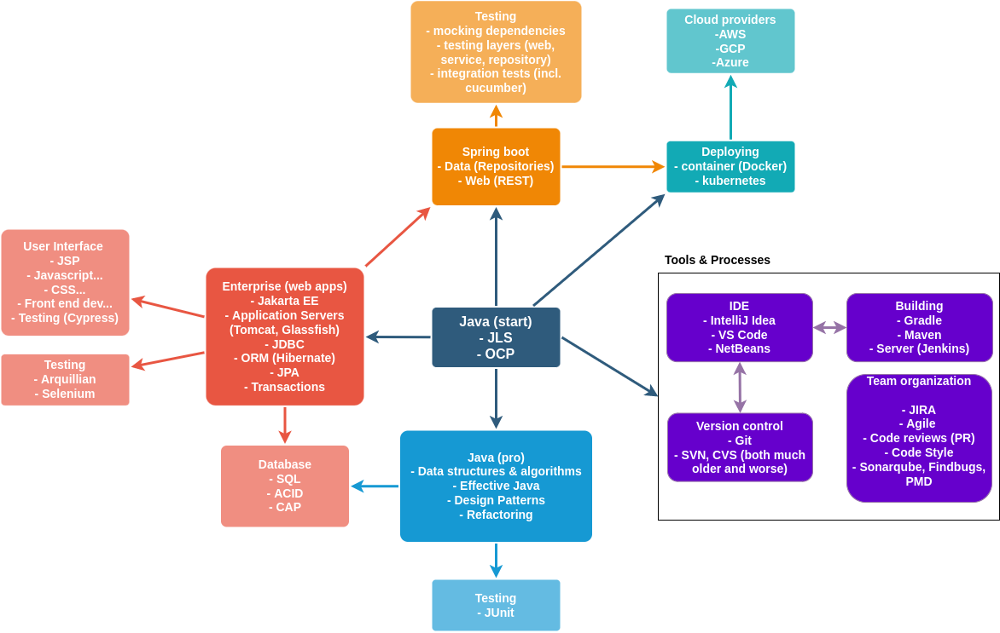

# Prerequisites
- Java SE: 
Oracle [releases](https://www.oracle.com/java/technologies/java-se-support-roadmap.html) new Java SE versions every 6 months, on March and September, but some of these are long-term supported versions.
Enterprises typically use these LTS versions, hopefully the latest available. As of this writing, the latest Java LTS version is Java 17,
which you have to download from [Oracle download's site](https://www.oracle.com/java/technologies/downloads/) and install.

- Integrated Development Environment (IDE):
This is a tool you'll use in your daily work as a developer. I've tried Eclipse, NetBeans, and IntelliJ Idea,
and I recommend you to [download IntelliJ Idea](https://www.jetbrains.com/idea/download/#section=linux), the community edition doesn't require paying a license to use it.

- Version control program (Git):
Git is a version control program developed by Linux Torvalds (Linux OS creator) which is commonly used to keep track of
source code versions. It can be downloaded [here](https://git-scm.com/). In that same website you can read (or download) an [ebook about 
Git](https://git-scm.com/book/en/v2), but I'd recommend first having a look at two common ways of working with Git:
  - [feature branch workflow](https://www.atlassian.com/git/tutorials/comparing-workflows/feature-branch-workflow#:~:text=The%20core%20idea%20behind%20the,without%20disturbing%20the%20main%20codebase.) it's used frequently
  - [trunk based development](https://www.split.io/glossary/trunk-based-development/#:~:text=Trunk%2Dbased%20development%20(TBD),%2C%20the%20%E2%80%9Cmaster%20branch%E2%80%9D.) it's not used that often, but also worth knowing

# Java Virtual Machine (JVM), Java Runtime Environment (JRE), Java Development Kit (JDK), Java Standard Edition (SE) and JakartaEE
Java is a compiled language that, unlike C/C++ programs (which have to be compiled for a specific
CPU like x86_64 or arm64), runs in the Java Virtual Machine (JVM). Time ago, Java could be downloaded from Oracle as either the
Java Runtime Environment (JRE), which only comprised the JVM necessary to run Java compiled programs, or as the Java Development Kit (JDK) which
not only contains the JVM, but also the Java compiler as well as other tools.

Finally, Java programming language is a rich ecosystem, and there have been several tools/frameworks built on top of it, to ease development 
and deployment of enterprise applications, for instance JakartaEE (previously named JavaEE and even J2EE) or Spring

# Java learning paths
The Java ecosystem is wide, and there are many terms and concepts that can (and they did for me at the beginning) overwhelm
you. Before starting you journey, take a look at the image below, it maps concepts and skills common to developers and to Java:

I'd start with Java (start), get familiar with the [Java Language Specification (JLS)](https://docs.oracle.com/javase/specs/). 
The JLS is too "dry" to learn Java from, but it's the ultimate source of truth in case of doubt.

When you start writing your first Java programs, use an IDE (Integrated Development Environment). I'd recommend IntelliJ Idea (the community edition
is free to use, if not, your local Java Users Group might help you get a license for it). It's not necessary to get Oracle's Certificate of professional
Programmer (OCP), but review the [list of topics](OracleCertTopics.md) that you would have to know in order to pass the certification exam, it's a good
starting point on what are the most important things to learn from the Java Language Specification (JLS).

Once you know the basics of Java language, then follow up with Java (pro) and at the same time gain familiarity
with the other tools and processes: Version control with Git, Building with Gradle or Maven (you will have to work with
both of them, but I think Gradle might be easier to start with), and also the Team organization tools (Jira, Agile mindset,
code reviews, Pull requests, code style and static code analysis tools).

## Here's an index of contents and resources for each block:

### Java (start):

  - Udemy free [introduction course to Java](https://www.udemy.com/course/getting-started-with-java/)
  - Codecademy (Java track) has a [free introduction course to Java](https://www.codecademy.com/learn/learn-java)
  - Some [java exercises](https://programmingbydoing.com/)
  - [Java Language Specification (JLS)](https://docs.oracle.com/javase/specs/)
  - [Oracle Java tutorials](
    https://docs.oracle.com/javase/tutorial/tutorialLearningPaths.html#newtojava)
  - W3Resource has many short Java exercises (with the solution): 
    - Basic [First set of 150](https://www.w3resource.com/java-exercises/basic/index.php) and another [set of 100 more](https://www.w3resource.com/java-exercises/basic/index1.php)
    - [Data types exercises](https://www.w3resource.com/java-exercises/datatypes/index.php)
    - [Conditional statements](https://www.w3resource.com/java-exercises/conditional-statement/index.php)
  - A website with exercises for different programming languages has a Java track (registration required, but free to use):
    [Exercism](https://exercism.org/tracks/java)
  - [Freecodecamp.org Youtube video](https://www.youtube.com/watch?v=A74TOX803D0) explaining the Java basics
  - [Another set of videos](https://testautomationu.applitools.com/java-programming-course/) to learn Java basics.
  - If you're more into reading books, I'd recommend Cay Horstmann's
    Core Java books (there are two, first volume is the ["Fundamentals"](https://www.amazon.es/Core-Java-Fundamentals-Oracle-Press/dp/0137673620/), 
    and volume 2 is the ["Advanced"](https://www.amazon.es/Core-Java-Vol-II-Advanced/dp/0137871074/))
  
### Tools & Processes (IDE):
I suggest you to learn to compile and execute Java application manually, executing `javac` and `java` before leaning on
an IDE to do that for you. An IDE offers many advantages, like syntax checking, code navigation, dependencies and many more.
Here are a few IDEs to choose from:
- [IntelliJ Idea](https://www.jetbrains.com/idea/) by JetBrains is my favourite integrated development editor (I've tried Eclipse and Netbeans in my career). 
  It is very [well documented](https://www.jetbrains.com/help/idea/getting-started.html).
- [NetBeans](https://netbeans.apache.org/) is also a good IDE which I used for many years.
- [VS code](https://code.visualstudio.com/) supports most of the frontend languages out of the box, and Java through an extension. 
  I haven't used it personally.
 
### Tools & Processes (Version control):
Nowadays, there's only one version control program worth mentioning: [Git](https://git-scm.com/). It was developed by
Linus Torvalds, and has superseded other older version control programs like Subversion or CVS. [Here is](https://www.freecodecamp.org/news/git-and-github-for-beginners/)
a good introduction to Git, and the online documentation in Git's website is also worth checking, there's even the "Pro Git" book available there.

### Java (pro): 
I learnt these while I was actively writing programs. I don't think these topics are easy to learn just
  from a theoretical point of view, it's better if you can learn them while you write Java programs.

 - Data structures & Algorithms: honestly, for most of the day to day programs you will only need to know
   about ArrayList, HashSet, HashMap and TreeMap. But it's still good to know about other, more specialized data structures and
   how they compare to each other in terms of efficiency, and when they are best used. In order to understand the 
   differences, you will have to know what "Big O notation" is (for instance is well explained in [this blog post](https://www.linkedin.com/pulse/big-o-notation-simple-explanation-examples-pamela-lovett/)). 
   I used Robert Lafore's ["Data Structures and Algorithms in Java"](https://www.amazon.es/Data-Structures-Algorithms-Robert-Lafore/dp/0672324539/) book
   but there are many online blogs, or videos (like [this, about data structures](https://www.youtube.com/watch?v=8MmMm2-kJV8)), and even some [funny videos](https://youtu.be/Iv3vgjM8Pv4) explaining these algorithms.
 - There's a great book by Joshua Block, ["Effective Java"](https://www.amazon.es/Effective-Java-Joshua-Bloch/dp/0134685997/) which
   gives very good advice on how to write real good Java code.
 - Another good book on how to write high quality Java code is Martin Fowler's ["Refactoring: Improving the Design of Existing Code"](https://www.amazon.es/Refactoring-Improving-Design-Existing-Technology/dp/0201485672/).
   It's in its 2nd edition now (has examples in Javascript), but the first edition from 1999 does have examples in Java code.
 - The third book I'd recommend reading is Erich Gamma et.al. ["Design Patterns: Elements of Reusable Object-Oriented Software"](https://www.amazon.es/Design-Patterns-Object-Oriented-professional-computing/dp/0201633612/).
   It contains examples of commonly used patterns in Java programs, and when are they used. These [design patterns can also be checked online](https://java-design-patterns.com/).  

